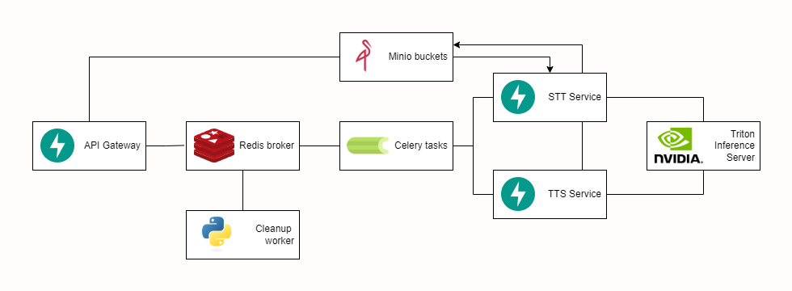
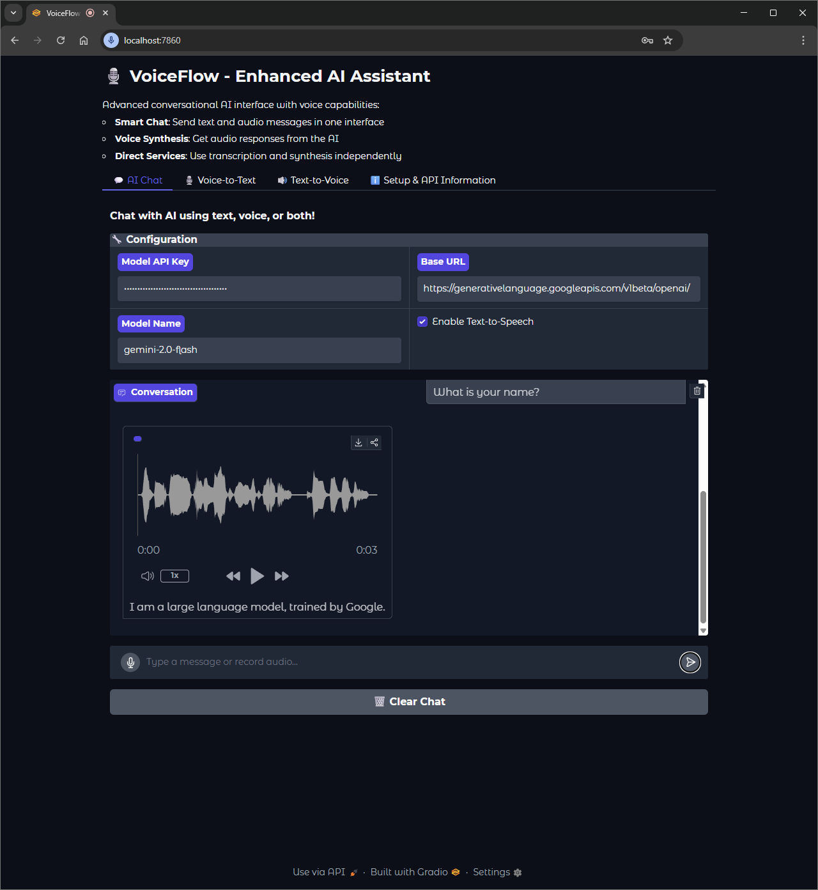
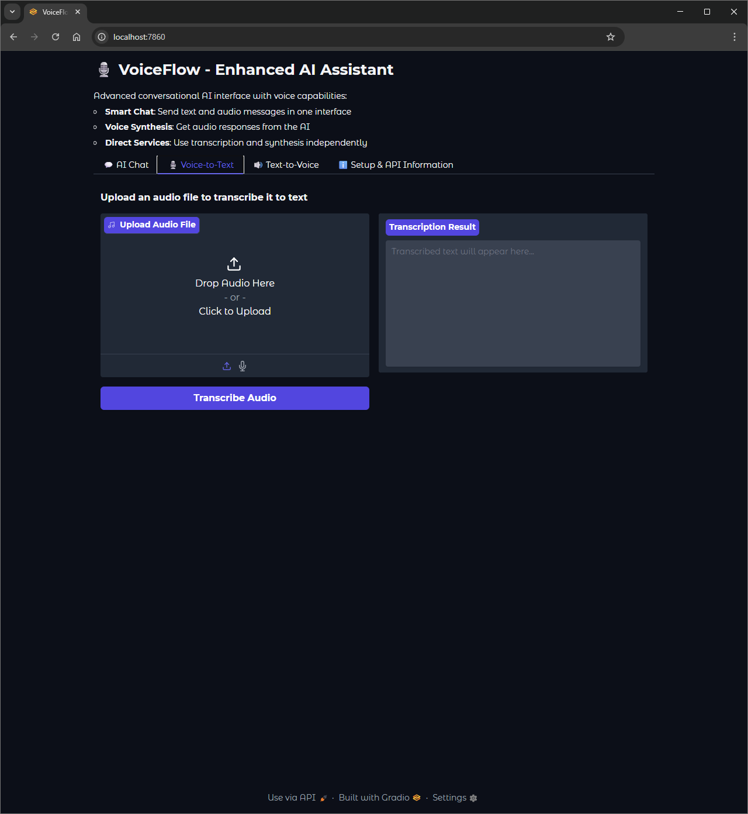
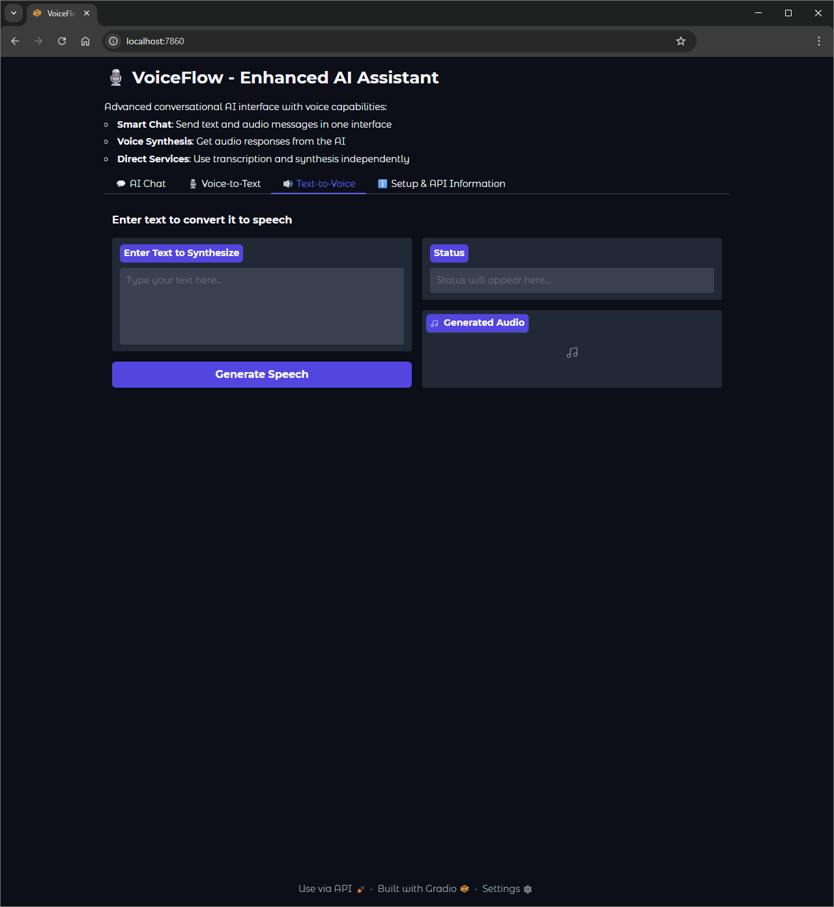
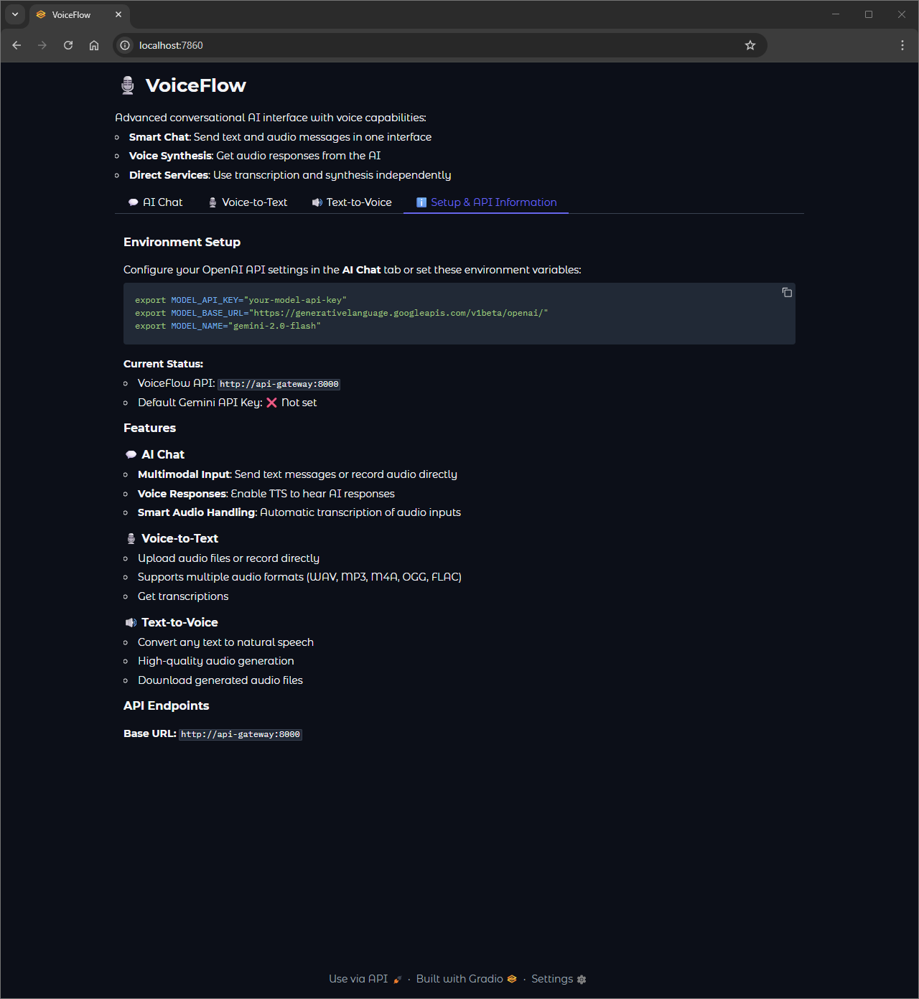

<div id="top"></div>
<br/>
<br/>
<br/>


<p align="center">
  
</p>
<h1 align="center">
    <a href="https://github.com/Armaggheddon/VoiceFlow">VoiceFlow 🎙️🔊</a>
</h1>

<div align="center">

[](LICENSE)
[](https://python.org)
[](docker-compose.yaml)

**A production-ready microservices platform for AI-powered speech processing**

[Features](#features) • [Quick Start](#quick-start) • [Architecture](#architecture) • [API Reference](#api-reference) • [Client Library](#client-library)

</div>

## 📋 Overview

VoiceFlow is a scalable platform that provides two core AI services through a unified API:

- **🎙️ Voice-to-Text (V2T)**: Transcribe audio files to text using Whisper
- **🔊 Text-to-Speech (T2V)**: Convert text to natural-sounding speech

Built with a microservices architecture using FastAPI, Docker, and NVIDIA Triton Inference Server for high-performance AI model serving.

## ✨ Features

- 🎙️ **Speech Recognition**: High-accuracy audio transcription using Whisper
- 🔊 **Speech Synthesis**: Natural-sounding text-to-speech conversion
- 🚀 **Microservices Architecture**: Scalable, containerized services
- ⚡ **NVIDIA Triton**: High-performance model inference server
- 📦 **Object Storage**: MinIO for efficient audio file management
- 🔄 **Async Processing**: Celery-based task queue with Redis
- 🎯 **REST API**: Simple, well-documented HTTP endpoints
- 🧹 **Auto Cleanup**: Automatic cleanup of temporary files
- 🎨 **Web Interface**: Built-in Gradio-based demo UI
- 📚 **Python Client**: Feature-rich client library with sync/async support

## 🚀 Quick Start

### 📋 Prerequisites

- Docker and Docker Compose
- 8GB+ RAM (for AI models)
- NVIDIA GPU (optional, but recommended for better performance)

### 1. Clone and Start

```bash
git clone https://github.com/Armaggheddon/VoiceFlow
cd VoiceFlow
docker compose up -d
```

### 2. Verify Services

```bash
# Check all services are running
docker compose ps

# Test the API
curl http://localhost:8000/health
```

### 3. Access the Demo UI

Open your browser to [http://localhost:7860](http://localhost:7860) to access the web interface. See the [Demo UI section](#-demo-ui) for more details.

### 4. Try the API

**Transcribe audio:**
```bash
curl -X POST http://localhost:8000/v1/transcribe \
     -F "audio_file=@sample.wav"
```

**Synthesize speech:**
```bash
curl -X POST http://localhost:8000/v1/synthesize \
     -F "text=Hello, this is VoiceFlow!"
```

## 🏗️ Architecture


*Image: Microservices architecture diagram showing API Gateway, Orchestrator (Celery), STT/TTS services, Triton Server, MinIO, and Redis*

### 🔧 Core Components

| Service | Technology | Purpose |
|---------|------------|---------|
| **API Gateway** | FastAPI + Minio | Public REST API endpoints and file upload handling |
| **Orchestrator** | Redis + Celery | Workflow coordination and task management |
| **STT Service** | FastAPI + Triton + Minio | Speech-to-text transcription using Whisper |
| **TTS Service** | FastAPI + Triton + Minio | Text-to-speech synthesis |
| **Inference Service** | NVIDIA Triton | High-performance model serving |
| **Demo UI** | Gradio | Web-based user interface |
| **Cleanup Worker** | Python + Celery + Minio | Automatic file cleanup |

### 🏗️ Infrastructure

- **MinIO**: S3-compatible object storage for audio files
- **Redis**: Message broker and result storage for Celery
- **Docker**: Containerization and orchestration

### 🔄 Request Flow

#### 🎙️ Voice-to-Text (V2T)
1. Client uploads audio file to API Gateway
2. File stored in MinIO, task queued in Orchestrator
3. STT Service downloads file, processes with Whisper via Triton
4. Transcription result stored in Redis
5. Client polls for result and receives text

#### 🔊 Text-to-Speech (T2V)
1. Client sends text to API Gateway
2. Task queued in Orchestrator
3. TTS Service generates audio via Triton, uploads to MinIO
4. Audio URL stored in Redis
5. Client polls for result and receives presigned download URL

## ⚙️ Configuration

### GPU Support (Default configuration)

To enable GPU acceleration:

1. Install NVIDIA Container Toolkit
2. Restart services:

```bash
docker compose down
docker compose up -d
```

### CPU-Only Mode

VoiceFlow works without GPU, though with reduced performance. To run in CPU-only mode, comment out the `deploy` section of the `inference-service` in `docker-compose.yaml`:

```yaml
inference-service:
    build:
      context: .
      dockerfile: ./services/inference-service/Dockerfile
    restart: unless-stopped
    environment:
      # Available whisper models:
      # - tiny ~ 1GB RAM
      # - base ~ 1GB RAM
      # - small ~ 2GB RAM
      # - medium ~ 5GB RAM
      # - large ~ 10GB RAM
      # - turbo ~ 6GB RAM
      - WHISPER_MODEL_SIZE=small
    # deploy:
    #   resources:
    #     reservations:
    #       devices:
    #         - driver: nvidia
    #           count: 1
    #           capabilities: [gpu]
    volumes:
      - ./services/inference-service/model_repository:/model_repository
    networks:
      - voiceflow-net
```

Then, use the same `docker-compose.yaml` file to start the services:

```bash
# Use CPU-only configuration
docker compose up -d
```

### 🎛️ Model Customization

#### 🎤 STT Models (Whisper)
Chose the whisper model size by setting the `WHISPER_MODEL_SIZE` environment variable in the `inference-service` section of `docker-compose.yaml`. Available options include:
- `tiny` (1GB RAM)
- `base` (1GB RAM)
- `small` (2GB RAM)
- `medium` (5GB RAM)
- `large` (10GB RAM)
- `turbo` (6GB RAM, optimized for speed)

#### 🗣️ TTS Models (Chatterbox)
- The model used for TTS is [Chatterbox](https://github.com/resemble-ai/chatterbox) from Resemble AI, which supports multiple voices and languages and is optimized for high-quality speech synthesis. 

## 📚 API Reference

### 🌐 Base URL
```
http://localhost:8000
```

### 🔗 Endpoints

#### POST /v1/transcribe
Transcribe audio file to text.

**Request:**
```bash
curl -X POST http://localhost:8000/v1/transcribe \
     -F "audio_file=@audio.wav"
```

**Response:**
```json
{
  "task_id": "550e8400-e29b-41d4-a716-446655440000",
  "status": "PENDING"
}
```

#### POST /v1/synthesize  
Convert text to speech.

**Request:**
```bash
curl -X POST http://localhost:8000/v1/synthesize \
     -F "text=Hello world"
```

**Response:**
```json
{
  "task_id": "550e8400-e29b-41d4-a716-446655440001", 
  "status": "PENDING"
}
```

#### GET /v1/tasks/{task_id}
Get task result.

**Transcription Result:**
```json
{
  "task_id": "550e8400-e29b-41d4-a716-446655440000",
  "status": "SUCCESS",
  "transcribed_text": "Hello, this is the transcribed text",
  "audio_url": null
}
```

**Synthesis Result:**
```json
{
  "task_id": "550e8400-e29b-41d4-a716-446655440001",
  "status": "SUCCESS", 
  "transcribed_text": null,
  "audio_url": "https://presigned-download-url"
}
```

For complete API documentation, see [API_DOCUMENTATION.md](API_DOCUMENTATION.md).

## 🐍 Client Library

VoiceFlow includes a comprehensive Python client library for easy integration:

### 📦 Installation

```bash
cd client-library
pip install -e .
```

### 💡 Quick Example

```python
from voiceflow import VoiceFlowClient

# Initialize client
client = VoiceFlowClient(base_url="http://localhost:8000")

# Transcribe audio
result = client.transcribe("audio.wav")
print(f"Transcription: {result.transcribed_text}")

# Synthesize speech
result = client.synthesize("Hello, world!")
print(f"Audio URL: {result.audio_url}")

# Download audio as numpy array
audio_array = client.synthesize("Hello!", output_format="numpy")
```

### ✨ Features

- 🔄 **Sync & Async**: Both synchronous and asynchronous interfaces
- 📝 **Type Hints**: Full type annotation support  
- 🛡️ **Error Handling**: Comprehensive error handling
- ⏱️ **Auto Polling**: Built-in result polling with timeouts
- 🎵 **Multiple Formats**: Support for various audio output formats

### ⚡ Async Usage

```python
import asyncio
from voiceflow import AsyncVoiceFlowClient

async def main():
    async with AsyncVoiceFlowClient(base_url="http://localhost:8000") as client:
        # Concurrent processing
        tasks = [
            client.transcribe("audio1.wav"),
            client.transcribe("audio2.wav"),
            client.synthesize("Text to speech")
        ]
        results = await asyncio.gather(*tasks)
        
        for result in results:
            print(result)

asyncio.run(main())
```

See the [client library documentation](client-library/README.md) for detailed examples and API reference.

## 🎨 Demo UI

VoiceFlow includes a built-in web interface accessible at [http://localhost:7860](http://localhost:7860).

| | |
|:---:|:---:|
|||
|||

*Image: Demo UI showing both transcription and synthesis interfaces with file upload and audio playback*

### ✨ Features

- 📁 **File Upload**: Drag-and-drop audio file upload
- 🎙️ **Live Recording**: Record audio directly in browser
- 🔊 **Audio Playback**: Play synthesized audio inline
- 📋 **History**: View previous transcriptions and syntheses
- ⚙️ **Configuration**: Adjust API settings and model parameters


## 🛠️ Development

### 📁 Project Structure

```
voiceflow/
├── services/
│   ├── api-gateway/          # REST API endpoints
│   ├── orchestrator/         # Task coordination
│   ├── stt-service/          # Speech-to-text
│   ├── tts-service/          # Text-to-speech
│   ├── inference-service/    # NVIDIA Triton models
│   ├── demo-ui/             # Gradio web interface
│   └── cleanup-worker/      # File cleanup
├── client-library/          # Python client
├── shared/                  # Common models and utilities
├── data/                    # Storage volumes
└── docker-compose.yaml      # Service orchestration
```


## 🚀 Performance Tuning

### 📈 Scaling Guidelines

- **API Gateway**: CPU-bound, scale horizontally
- **STT/TTS Services**: GPU-bound, scale based on GPU availability  
- **Orchestrator**: I/O-bound, scale based on queue depth
- **Triton Server**: Memory-bound, tune model batch sizes

### 💾 Resource Requirements

| Component | Minimum | Recommended |
|-----------|---------|-------------|
| **CPU** | 4 cores | 8+ cores |
| **RAM** | 8 GB | 16+ GB |
| **GPU** | None | 8+ GB VRAM |
| **Storage** | 10 GB | 100+ GB SSD |

### 🎯 Optimization Tips

1. **Enable GPU acceleration** for 5-10x performance improvement
2. **Tune batch sizes** in Triton model configurations
3. **Configure connection pooling** for high-throughput scenarios
4. **Use faster storage** (SSD) for MinIO data volumes
5. **Scale horizontally** by adding more service replicas


## 🙌 Contributing
Contributions are welcome! Whether it's bug fixes, new features, or documentation improvements, feel free to open an issue or submit a pull request.

## 📜 License

This project is licensed under the MIT License - see the [LICENSE](.LICENSE.md) file for details.

## 🙏 Acknowledgments
- [Chatterbox](https://github.com/resemble-ai/chatterbox) for speech synthesis
- [OpenAI Whisper](https://github.com/openai/whisper) for speech recognition
- [NVIDIA Triton](https://github.com/triton-inference-server) for model serving
- [FastAPI](https://fastapi.tiangolo.com/) for API framework
- [Celery](https://docs.celeryproject.org/en/stable/) for task management
- [MinIO](https://min.io/) for object storage
- [Redis](https://redis.io/) for message brokering
- [Gradio](https://gradio.app/) for the demo interface

---


<div align="center">

**Built with ❤️ for the AI community**

[⬆ Back to Top](#voiceflow-️)

</div>
